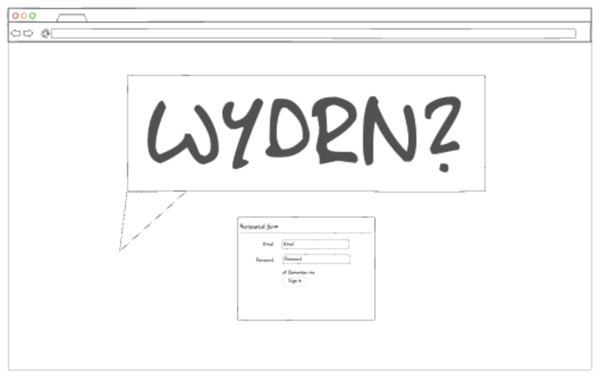
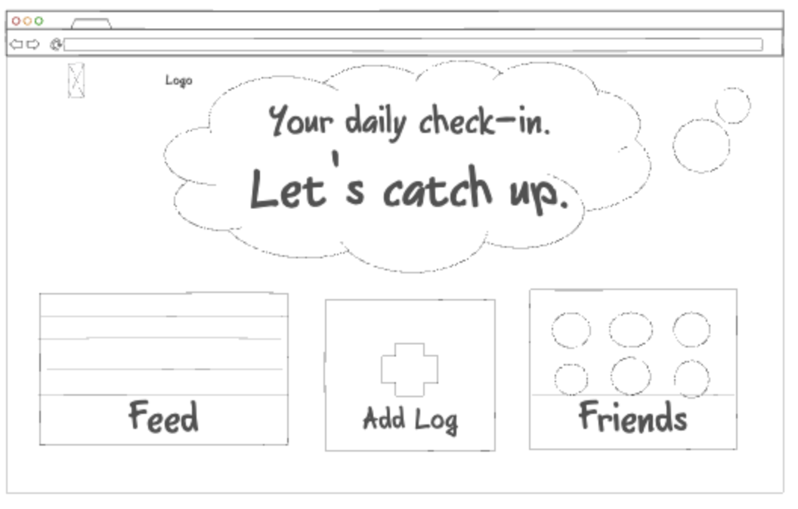
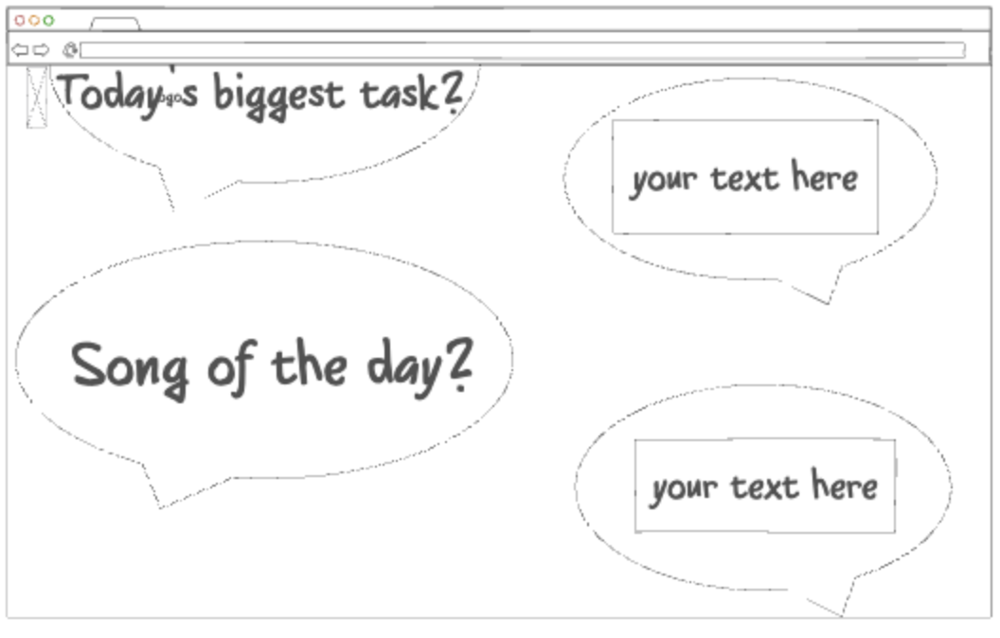

# cs260
[Notes](/startup/notes.md)
## Startup Deliverable
### Elevator Pitch
How many times have you tried keeping a journal? Maybe you'll get a week in, forget to do it one day, and abandon it altogether. Maybe you journal consistently, but you never know what to write. WYDRN, short for "what're you doing right now?" is an interactive and social journaling application that not only streamlines the journaling experience, but adds some excitement to it, too. At a random time each day, users will be notified that it's time to add their daily log. They are then given a series of interesting journaling prompts in the form of a text message coversation that features both written and multiple choice responses. Only after they complete their daily log will they have access to a feed featuring friends' responses. 
### Design

Login Page

Main Page

Journal Page

### Key Features
* Secure login over HTTPS
* Ability to request and accept friend status from other accounts
* Ability to view and comment on friends' logs in realtime feed
* Personal logs are archived and available for viewing
* Ability to type text and select options via mouse in response to prompts
### Technologies
Each of the following technologies will be utilized:

**HTML -** HTML will be used to format the content of each page. Three pages: login page, journal page, and feed/friend page

**CSS -** CSS will add style on various displays through color, shape, spacing, etc.

**JavaScript -** JavaScript will make each page interactive through a secure login, responding to prompts, following friends, and commenting on the feed

**Authentication -** User accounts will be authenticated using a secure login over HTTPS

**WebSocket Data -** Journal logs and comments will be posted to the feed in realtime

**Database Data -** A database will be utilized to store users' daily journal responses

